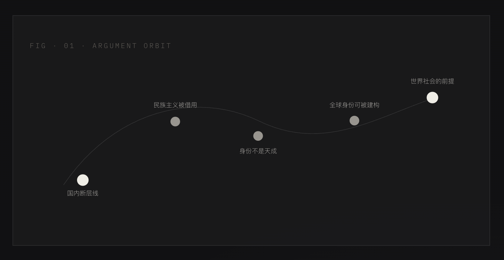
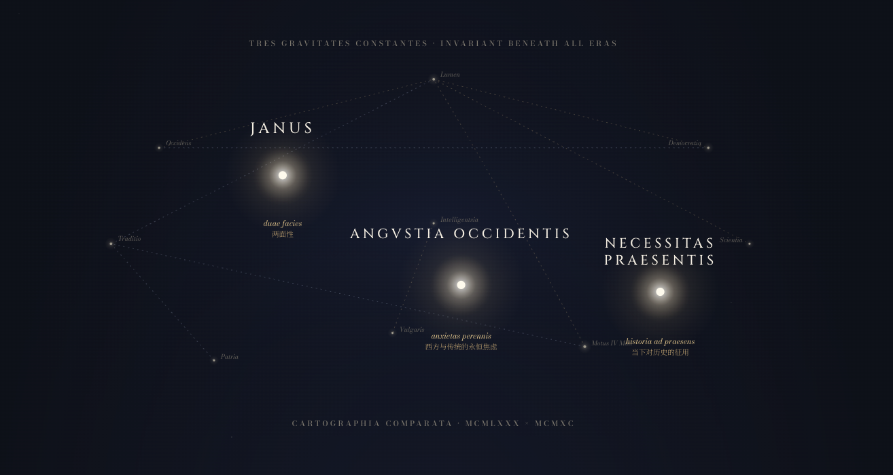

<div align="center">

# 点校 · Collate

和你的 Agent 一起阅读历史、思考历史、书写历史。<br />
从一页扫描到一篇定稿，从单篇论文的透视到整个学术场的地图。


> 建立：2026-04-19 · Alice、Claude Opus 4.7、Claude Opus 4.6 与 GPT-5.4 共笔 · 代码 Apache-2.0，引用材料 CC-BY-4.0

[English](README.md) · [中文](README.zh.md)

</div>

---

## 这是什么

一张三方共用的工作台 —— 一位历史学者、与之共事的 agent、以及文本被流转的原作者。人类提供扫描原件,持有最终的学术判断。Agent 承担其间耐心、重复的劳动:清理、识别、点校、自审、排版。每一份中间产物都留在 workspace 里,任何一处决定都可以回溯到它来自的那一页。

流水线之外还有一层**阅读层** —— 把恢复出来的文本作为学术而非数据来读的 skill 与命令。为单篇论文透视它的论证、为整片文献绘出场域的形状、核查一条引证、读出作者选择不说的部分、为某个关键概念定义、贴近作者反复趋近但不敢正面落笔的那个论题。这些不是抽取。这些是加入历史学者一直在进行的那场对话的不同方式。

工具箱以 **Claude Code 插件**形式分发,同时原生支持 **Codex**、**Gemini CLI** 和 **Cursor**。任何能跑 Python、读 Markdown 知识库的 runtime 都可以通过 `AGENTS.md` 接入。

*Collate* 对应中文的**点校** —— 中国古代学者断句、勘误、校异的传统工夫。我们以当代的 OCR 与 agent 工具,延伸这门有千年积淀的手艺。我们不擅自改良所点之文,我们只让它重新可读。

---

## 立场

工作台前会面的是三方。把它们一一命名,工程才能保持诚实。

- **历史学者** —— 提出问题的人。学术判断的最终权威。Agent 从不替你决定一段文字的含义;它们把文本整理到位,让你能判断。
- **Agent** —— 工作的共同作者,不是自动售货机。它们承担那些耐心的劳动:擦去一个水印、扫一遍易混字、把五步清单一条一条走完、把每一处改动留痕以便审。它们的推理被刻意留在可见处,因为不留痕的工作就是不可被信任的工作。
- **原文的作者** —— 在每一行经过这条流水线的字句里都在场。整套装置之所以存在,是为了让他们写下的文字能被再次阅读、被正确引用、被对话。我们点校传世之书,不暗中改写它。

中间产物、标注、修改记录,全部留在 workspace 里。这个工具箱端到端可审计 —— 因为在这种尺度上,尊严唯有在被看见时才能存活。

---

## 一瞥

阅读类 skills 自己产出的三张图。



> `/collate:xray-paper <paper.md>` —— 把一篇文章的论证画成它的论点实际走出来的曲线,而不是行文呈现的顺序。


> `/collate:constellatio 五四` —— 对有争议现象做接受史分析:每个时代的读法需要从历史里取走什么,以及对象内部让每代投射都贴得上的那道结构性裂缝。可选的同级星图把这些读法画成星座。



> `/collate:constellatio` 跨时代散文输出 —— 每代读法作为自身处境的诊断,以及让任何时代都无法定夺它的那道屏幕属性。

---

## 快速开始

### 1 · 安装

**Claude Code 用户** —— 在 CLI 里两行,不用克隆仓库:

```
/plugin marketplace add MidnightDarling/collate
/plugin install collate@collate
```

**其他 runtime**(Codex CLI / Cursor / Gemini CLI)—— 一条 shell 命令克隆仓库、装 Python 依赖,并自动接入检测到的 runtime:

```bash
curl -fsSL https://raw.githubusercontent.com/MidnightDarling/collate/main/scripts/install.sh | bash
```

参数:`--target PATH`(默认 `~/.local/share/collate`)· `--no-deps` · `--no-runtimes` · `--dry-run` · `--help`。通过管道传参用 `bash -s -- <flags>`。

系统依赖:`poppler`(macOS 用 `brew install poppler`,Debian/Ubuntu 用 `apt install poppler-utils`)。分 runtime 的接入细节见 [docs/INTEGRATIONS.md](docs/INTEGRATIONS.md);详细安装步骤见 [INSTALL.md](INSTALL.md)。

### 2 · 自检

```
/collate:setup
```

诊断 Python 版本、十个依赖包、`pdftoppm` 二进制、OCR 引擎凭据。逐项报告通过/缺失,每个缺失给一条修复建议。从不自动安装。

在会直接暴露 skill 的 runtime 里，`setup` 是 skill 本身的 slash surface，不再需要一层同名 command 壳。

### 3 · 跑

**公开用户路径** 只有 `/collate:ocr <pdf-path>`。
`python3 scripts/run_full_pipeline.py --pdf <pdf-path>` 只是内部 / 调试入口，
除非它也通过同一套 fresh-agent + real-PDF gate，否则不能单独当发布证据。

支持两种入口:

| 入口 | 适用 |
|------|------|
| `/collate:ocr <pdf-path>` | 公开的一次性完整入口 —— agent 自主跑完并对最终交付负责 |
| `python3 scripts/run_full_pipeline.py --pdf <pdf-path>` | 内部 / 调试机械入口,适合 CI 与批量任务,但本身不构成发布完成 |

agent 入口是 canonical 路径:它调机械总编排脚本、生成逐页 review packets、带着页图证据调 `historical-proofreader`、机械验证 review 完整性、再重入总编排脚本完成应用修改与自审、把交付总结原样上抛。

smoke 通过和 truthful failure 只算 guardrail,不算发布完成。真正的发布标准仍然只有这一句:

```text
fresh clone + supported agent runtime + /collate:ocr <real-pdf> + no human intervention + valid final.docx/wechat.html
```

---

## 兼容性

每个 runtime 一个状态标签。每条声明都对应到具体文件或命令 —— 没有原生支持的地方,绝不包装成原生。

| Runtime | 状态 | 原生入口 | 安装方式 | 备注 |
|---------|------|---------|----------|------|
| **Claude Code** | Supported | `.claude-plugin/plugin.json` · `.claude-plugin/marketplace.json` | `/plugin install collate@collate` | 原生插件;在 Claude Code marketplace 端到端验证。 |
| **Codex** | Supported | `.codex-plugin/plugin.json` · `.agents/plugins/marketplace.json` · `AGENTS.md` | repo 级 marketplace | 通过 Codex 的 marketplace 入口原生支持。 |
| **Cursor** | Supported | `.cursor/rules/collate.mdc` | `git clone` — Cursor 打开时自动加载规则 | `alwaysApply: true` 项目规则;skill 通过 shell 工具调起。 |
| **Gemini CLI** | Supported | `GEMINI.md` · `gemini-extension.json` | `gemini extensions install` 或 `git clone` 后运行 `gemini` | 原生上下文文件每次会话自动加载;扩展清单支持 gallery 安装。 |

每一行的具体接线步骤见下方 [`## 分 runtime 接入`](#分-runtime-接入)。

---

## 工作流

```
Human: scanned PDF
  │
  ▼
Agent 自主执行
  1. prep-scan        去水印 / 去馆藏章 / 裁页眉页脚
  2. visual-preview   清理结果可视化自检
  3. ocr-run          识别为 Markdown
  4. proofread        生成 A/B/C 三级校对清单
  5. (agent 按清单修改正文)
  6. diff-review      自审:采纳 / 漏改 / 清单外修正 / 未锚定
  7. to-docx          学术规范 Word 稿
  8. mp-format        公众号推文 HTML
  │
  ▼
Human: final.docx + final.mp.html + 审计日志
```

**核心原则**:AI 不替人做学术判断。校对阶段产出机器可读的分级清单,agent 按清单修正后,通过 diff-review 自审留痕。所有中间产物、标注、修改记录保留,交付时人类能逐条回溯。

### 文献类型

校对层内置三套校准过的知识库。类型由 agent 判定,或调用时传入 `--type=classics|republican|modern`。

| 类型 | 典型问题 | 知识库 |
|------|---------|--------|
| 现代简体论文 | 扫描噪点、字形混淆(曰/日、己/已/巳)、标点漂移、参考文献格式 | `skills/proofread/references/modern-chinese.md`;GB/T 7714 |
| 民国排印本 | 繁简并存、旧式标点、译名过渡期、新旧地名 | `skills/proofread/references/republican-era.md` |
| 繁体古籍 | 异体字、避讳字、竖排、无标点 | `skills/proofread/references/traditional-classics.md`;异体字不强改,避讳字仅标注 |

---

## 仓库结构

一个 **Claude Code 插件**(同时也是 runtime 无关的 Python 工具箱)—— 直接安装,或手动复制组件。

```
collate/
├── .claude-plugin/
│   ├── plugin.json              /plugin install 读取的清单
│   └── marketplace.json         marketplace 目录
├── .codex-plugin/
│   ├── plugin.json              Codex 原生插件清单
│   └── README.md                Codex 插件入口说明
├── .cursor/
│   └── rules/collate.mdc       Cursor 项目规则(alwaysApply)
├── .agents/
│   └── plugins/marketplace.json Codex 用的 repo 级 marketplace
│
├── skills/                      15 个 skill · 8 个流水线 + 7 个阅读层
│   ├── setup/                   环境诊断(Python、poppler、OCR 凭据)
│   ├── prep-scan/               PDF → 清理后逐页 PNG(HSV 章法、形态学水印、裁边)
│   ├── visual-preview/          逐页三态 HTML(原始 / 清理后 / 差异热图)
│   ├── ocr-run/                 MinerU 本地 / MinerU 云 / 百度 —— 输出 raw.md + meta.json
│   ├── proofread/               五步清单 + 三套类型知识库 → raw.review.md
│   ├── diff-review/             raw.md 与 final.md 对比,与清单关联
│   ├── to-docx/                 python-docx,统一学术规范
│   ├── mp-format/               公众号 HTML 内联 CSS + xiumi 附件
│   ├── xray-paper/              单篇历史论文 X 光透视(Obsidian 原生)
│   ├── paper-summary/           5–30 篇文献绘图(Obsidian 原生)
│   ├── chunqiu/                 读禁忌、定谳与策略性沉默
│   ├── kaozheng/                审引证、证据层级与 warrant
│   ├── prometheus/              为单个概念下定义并渲染 SVG 卡
│   └── real-thesis/             挖作者绕而不写的真论题
│
├── agents/                      2 个专职 subagent
│   ├── ocr-pipeline-operator.md 流水线总操作员:机械 → 校对 → 自审 → 交付
│   └── historical-proofreader.md 领域专家:执行五步清单,产出 A/B/C 校对
│
├── commands/                    2 个独立 command · 仅做总编排
│   ├── ocr.md                   /ocr — 一次性全流水线
│   └── status.md                /status — 读 _pipeline_status.json,报阶段与下一步
│
├── scripts/
│   ├── run_full_pipeline.py     机械总编排(不依赖 agent)
│   ├── apply_review.py          按 raw.review.md 把改动落到 raw.md,出 final.md
│   ├── pipeline_status.py       pipeline workspace 状态辅助
│   ├── review_contract.py       proofread / apply / diff 共享的 review 契约解析
│   ├── workspace_readme.py      把 workspace README 重写为当前目录地图
│   └── install.sh               跨 runtime 安装器
│
├── docs/
│   ├── ARCHITECTURE.md          skill 职责边界、数据流、文件布局
│   ├── INTEGRATIONS.md          分 runtime 的接入步骤
│   ├── TROUBLESHOOTING.md       常见报错与兜底
│   └── ...                      仅保留公开文档
│
├── GEMINI.md                    Gemini CLI 项目上下文(每次会话自动加载)
├── gemini-extension.json        Gemini CLI 扩展清单
├── AGENTS.md                    agent 契约 —— 调用约定、决策矩阵、失败处理
├── CONTRIBUTORS.md              作者与贡献者(署名,非法律归属)
├── INSTALL.md                   详细安装指南
├── NOTICE                       版权 + 共笔 + 第三方许可
├── LICENSE                      Apache-2.0(代码)
└── LICENSING.md                 CC-BY-4.0 适用范围说明
```

---

## Skills 详述

每个 skill 是自包含目录:`SKILL.md`(agent 读取的操作指令)+ `scripts/`(Python 工具)+ `references/`(结构化知识库,如适用)。Collate 现在明确以 skill 为唯一能力本体: **8 个流水线 skill + 7 个阅读 skill**。如果某个 slash surface 有能力，那能力就应该写回 skill 本身。

### 流水线 skill

> **setup**

环境诊断。验证 Python ≥ 3.9、十个依赖包、`pdftoppm` 二进制,以及 `~/.env` 中的 OCR 引擎凭据。逐项报告通过/缺失,每个缺失给一条修复建议。从不自动安装。

*触发*:首次安装,或者任何"OCR 怎么跑起来"的问题。

---

> **prep-scan**

源 PDF 预处理。每页按 300 DPI 切分,然后跑三轮清理:

- HSV 色域分离 + 连通域面积过滤 —— 去红蓝馆藏章。
- 灰度旋转 + 形态学开运算 `MORPH_OPEN` —— 去对角数据库水印(知网、读秀、维普)。
- 高斯模糊 + 顶帽变换 + 正文保护 —— 去浅色重复水印,不误伤正文。

可选页眉页脚裁切。产出:`<workspace>/prep/cleaned.pdf`,直接给下一步 OCR。

*触发*:"预处理 PDF"、"去水印"、"去馆藏章",或者凡是从知网/读秀/国图/档案数据库下载来的扫描 PDF。

---

> **visual-preview**

逐页三态 HTML —— 原始 / 清理后 / 差异热图,清理掉的部分以半透明红色叠在原图上。清理比 > 20% 的页自动标红,agent 据此决定是否调参重跑 `prep-scan`。

*触发*:`prep-scan` 跑完之后,或者"看看清理效果"、"对比一下"、"去水印成功没"。

---

> **ocr-run**

三引擎 OCR。默认走本地 **MinerU CLI**(`mineru[pipeline]`);`OCR_ENGINE=baidu` 切换百度云 OCR(成本优先);`OCR_ENGINE=mineru-cloud` 走 MinerU 云 API 作为兼容降级。专为历史文献优化的参数:繁体竖排、古籍异体字、民国新式标点、现代简体。

产出:`raw.md` + 原件/识别并排 HTML + `meta.json`(用了什么引擎、用时、低置信页)。

*触发*:"跑 OCR"、"识别文字"、"PDF 转文字"、"准备校对"。

---

> **proofread**

工具箱的合页。`historical-proofreader` agent 强制执行**五步清单**:

1. 结构健全性 —— 标题、脚注、段落完整性。
2. 字形扫描 —— 按类型 reference grep 字形混淆。
3. 规范扫描 —— 标点、引号、DOI / ISBN / 页码格式。
4. 跨段一致性 —— 术语、译名、引文格式。
5. 专名核查 —— 人名、地名、年号、官职。

产出 `raw.review.md`,条目按 **A**(OCR 错,必改)/ **B**(学术规范,应改)/ **C**(存疑待考)分级。每条带行号、原文片段、建议、依据。末尾附执行自证表,人能验证五步是不是真跑了。

*触发*:"校对这份稿子"、"看看 OCR 对不对"、"过一遍"。

---

> **diff-review**

闭环自审。agent 按 `raw.review.md` 改完后,本 skill 对比 `raw.md` 与改后的 `final.md`,生成段落级 HTML 报告,把每一处改动归到四种状态:

- **采纳** — agent 落实了清单的某条建议
- **漏改** — 清单上的条目没被处理
- **清单外修正** — 清单没要求,agent 自己加的修改
- **未锚定改动** — 没明显依据的改动

外加一份带计数的 `diff-summary.md`。这是端到端可审计的关键。

*触发*:任何一轮校对的收尾,或者"我漏改啥没"、"看看改了啥"、"diff"。

---

> **to-docx**

学术规范 Word,基于 python-docx。统一规范:思源宋体 SC 12pt 正文、1.2 行距、字间距 0.2 pt、上下左右 2 cm 页边距、段首缩进 2 字符、脚注连续编号、中文引号、图表题注位置。

*触发*:"出成 Word"、"给我一份 docx"、"投稿版本"、"给编辑看"。

---

> **mp-format**

公众号 HTML —— 大多数中文人文作者最实际的发布目标。全内联 CSS(公众号剥离外链样式表);OpenCC `t2s` 繁简转换施加于正文,**但保留 `>` 引用块的原貌**(引文不转换);脚注集中文末;作者 / 来源卡片。

同时输出一份 xiumi 兼容的 Markdown 附件,给习惯在秀米/壹伴里做最后视觉调整的用户。

*触发*:"排公众号"、"做成推文"、"秀米"、"发出去"。

### 阅读层 skill

上面的流水线在 `final.md` 干净之后结束。阅读层从那里开始。文本可靠了,工具箱才把它当作学术来读 —— 不是为了概述,而是为了进入历史学家之间的那场对话。`xray-paper` 与 `paper-summary` 是大房间;另外五个 lens skill 是更锋利的单问题工具。

> **xray-paper**

为单篇历史论文做实质深度的 X 光透视。还原作者追问的问题(问题意识)、定位论文在学术传统中的位置(学派谱系)、梳理论文的时间脉络、凝结与既有判断发生结构性碰撞的认知卡片。

产出:`<workspace>/analysis/{stem}_xray.md`,含 YAML frontmatter、callout、ASCII 年代纪、SVG 位置图。

*触发*:"分析这篇论文"、"X-ray 这篇文章"、"帮我定位这篇论文的位置"、"帮我读一下"。

---

> **paper-summary**

把 5–30 篇论文作为一个学术场绘制地图。八个交叉阅读维度:史料基础、学派谱系、时空覆盖、方法论分布、概念争议、理论借用、未竟难题、新手入门路径。

产出:`<workspace>/analysis/literature-map.md` 或 `docs/literature-map/{corpus-name}.md`。

*触发*:"综述这批文献"、"给这批论文绘图"、"给我看下这场域"、"这个领域现在什么样"。

---

> **chunqiu**

读禁忌、定谳与策略性沉默。最适合处理真正的力量不在明说,而在用字、重复、停顿与借古讽今里的论文。

产出:`analysis/{stem}_chunqiu.md`。

*触发*:"春秋笔法"、"作者不敢明说什么"、"借古讽今"、"读读沉默"。

---

> **kaozheng**

乾嘉式 evidential audit: claims、sources、warrants、citation rank、truncation risk。最适合处理"这篇论文到底站不站得住"而不是"它是什么意思"的问题。

产出:`analysis/{stem}_kaozheng.md`。

*触发*:"考证一下"、"核引证"、"这个论证站得住吗"、"审 warrant"。

---

> **prometheus**

为单个概念、制度或专名下定义,并渲染成一张 ATTRIBUTION 风格的 SVG 卡。最适合把一个词真正变成脑子里能抓住的东西。

产出:`analysis/prometheus/{concept}.svg`。

*触发*:"给这个概念下定义"、"做一张概念卡"、"这个词到底是什么"。

---

> **real-thesis**

挖出作者绕着走但不肯明写的论题。最适合那种表面主题明显比真实压力更安全、更窄的论文。

产出:`analysis/{stem}_real-thesis.md`。

*触发*:"它真正想说什么"、"挖真论题"、"作者到底在绕什么"。

---

> **constellatio**

对有争议历史现象做接受史分析。列出每种读法都必须包括的不可压缩事实,把每代读法当作那个时代自身处境的诊断,识别对象内部让每代投射都能贴住的结构性裂缝(屏幕属性)。可选暗夜星图 viewer 把各代读法作为视觉层叠加在共享的星点场上。

产出:`analysis/{stem}_constellatio.md`,可选 `analysis/{stem}_constellatio.html`。

*触发*:"接受史分析"、"为什么每个时代都读得不一样"、"constellatio"。

---

## 独立 Commands

现在只保留两个独立 command:

- `/collate:ocr <pdf>` —— 面向人的一次性总编排入口
- `/collate:status [workspace]` —— 状态与收口检查器

其余都改成 **skill-first**。在会直接暴露 skill 的 runtime 里,你直接调用 `/collate:<skill>`，不再维护一层同名 command 壳。若 command 里有 skill 没有的能力,那能力就应该并回 skill,而不是让双轨继续长下去。

| 命令 | 干什么 | 何时用 |
|------|--------|--------|
| `/ocr <pdf>` | 调度 `ocr-pipeline-operator`。一次调用跑完 prep → OCR → 校对 → 应用 → diff-review → docx → wechat,返回交付路径与审计摘要。 | 公开入口。把扫描 PDF 交给 agent,让它走完那一长段。 |
| `/status [workspace]` | 读 `<ws>/_internal/_pipeline_status.json`,报阶段/状态/下一步,逐项核对哪些交付物在场或缺失。 | 跑了一半被打断,或想知道接下来该干什么。 |

---

## Agents

两个 subagent 处理调度。Skill 是被动的指令文档;agent 拥有端到端编排和工具调用权。

| Agent | 角色 |
|-------|------|
| `ocr-pipeline-operator` | 流水线总操作员。调机械总编排、生成逐页 review packets、带页图证据调度 `historical-proofreader`、机械验证 review，再重入总编排串起 apply-review / diff-review / to-docx / mp-format,最后把面向人类的交付总结上抛。 |
| `historical-proofreader` | 领域专家。按文献类型加载对应 reference 表,执行强制五步清单,产出走 canonical 格式的 `raw.review.md`,末尾附执行自证表。 |

---

## 分 runtime 接入

每个 runtime 的状态标签与原生入口已在上方 [`## 兼容性`](#兼容性)诚实标注。本节给的是每一行对应的实地接线。

先两条通用捷径:

- **机械路径(无 agent)**:`python3 scripts/run_full_pipeline.py --pdf <input.pdf>` —— 适合 CI 与批量任务,但本身不算发布完成证据。
- **一次请求的 agent 路径**:`agents/ocr-pipeline-operator.md` + `agents/historical-proofreader.md` —— `/ocr` 调起的两个 agent。

原生识别 `AGENTS.md` 的 runtime 几乎零配置;其余需要一份短规则文件、wrapper manifest,或显式 shell-tool 调用。每个 runtime 的完整接入指南在 [docs/INTEGRATIONS.md](docs/INTEGRATIONS.md)。

| Runtime | 接入方式 |
|---------|----------|
| **Claude Code** | `/plugin install /path/to/collate`。原生 `.claude-plugin/plugin.json`;skills 注册为 `/collate:<skill>`，而独立 command 只保留 `ocr` 与 `status`。 |
| **Codex** | 仓库随发原生 `.codex-plugin/plugin.json` 与 repo 级 `.agents/plugins/marketplace.json`。支持 plugin directory 的 Codex 端重启后可直接从该 marketplace 安装 `collate`;在仓库里直接工作时,`cd /path/to/collate && codex` 仍会从 git root 自动加载 `AGENTS.md`。 |
| **Cursor** | 仓库随发 `.cursor/rules/collate.mdc`（`alwaysApply: true`）— Cursor 打开项目即自动加载。skill 通过 shell 工具调起;在新 chat tab 中加载 `agents/historical-proofreader.md` 作为 system prompt 来调度 subagent。 |
| **Gemini CLI** | 仓库随发 `GEMINI.md`（每次会话自动加载为项目上下文）与 `gemini-extension.json`（扩展清单）。克隆后运行 `gemini` 即可,或通过 `gemini extensions install` 安装。skill 通过 shell 工具调起;用 `-C agents/historical-proofreader.md` 起新会话调度 subagent。 |

---

## 依赖

Python 3.9+ 与:

```
opencv-python
pillow
pdf2image
requests
python-dotenv
markdown
beautifulsoup4
PyPDF2
python-docx
mineru[pipeline]
```

仅在 `mp-format --simplify` 时才需要的可选依赖：

```text
opencc-python-reimplemented
```

系统依赖:

- macOS:`brew install poppler`
- Debian/Ubuntu:`apt install poppler-utils`

---

## 环境变量

脚本读取以下变量,如何存储由调用方决定(推荐 `~/.env`,不建议 project 级 `.env`)。

| 变量 | 说明 |
|------|------|
| `OCR_ENGINE` | `mineru`(本地 CLI,默认)/ `baidu` / `mineru-cloud` |
| `MINERU_API_KEY` | 仅 `OCR_ENGINE=mineru-cloud` 需要 |
| `BAIDU_OCR_API_KEY` | `OCR_ENGINE=baidu` 需要 |
| `BAIDU_OCR_SECRET_KEY` | 同上 |

---

## 隐私

- **本地 MinerU CLI**(默认):完全本地处理,不上传任何内容。
- **MinerU 云 API**(`OCR_ENGINE=mineru-cloud`):当前实现先把 PDF 上传到 catbox.moe(匿名公开文件托管,24 小时保留),再把 URL 提交 MinerU。PDF 短暂暴露于公网;敏感材料请改用本地 CLI 或百度 OCR。
- **百度 OCR**(`OCR_ENGINE=baidu`):每页 base64 编码后 HTTPS 发往百度云,受百度 ToS 约束。

插件本身不发任何遥测或汇报请求。`~/.cache/baidu_ocr_token.json` 缓存百度 access token 24 小时。

---

## 文档入口

- [AGENTS.md](AGENTS.md) — agent 契约:每个 skill 的调用约定、决策矩阵、失败处理
- [docs/ARCHITECTURE.md](docs/ARCHITECTURE.md) — skill 职责边界、数据流、文件布局
- [docs/INTEGRATIONS.md](docs/INTEGRATIONS.md) — 分 runtime 的接入步骤
- [docs/TROUBLESHOOTING.md](docs/TROUBLESHOOTING.md) — 常见报错与兜底
- [CONTRIBUTORS.md](CONTRIBUTORS.md) — 作者与贡献者

---

## 许可

- **代码**(所有 Python 脚本、配置、shell 片段、SKILL.md):[Apache License 2.0](LICENSE)
- **引用材料**(docs/、skills/*/references/、README、AGENTS.md、原创插图):[CC BY 4.0](LICENSING.md)
- **第三方依赖**保留各自许可——见 [NOTICE](NOTICE)

版权 2026 Alice。与 Claude Opus 4.7(Anthropic)、Claude Opus 4.6(Anthropic)及 GPT-5.4(OpenAI)共笔;按 AI 协作作品的适用法律,版权由 Alice 独家持有,作者身份(authorship)为联合。详见 [NOTICE](NOTICE) 与 [CONTRIBUTORS.md](CONTRIBUTORS.md)。
